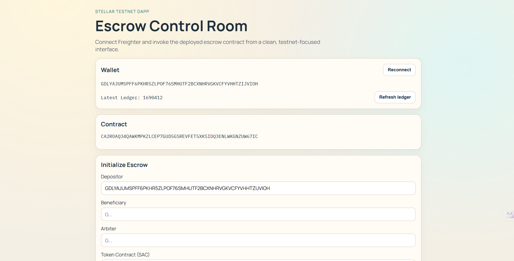
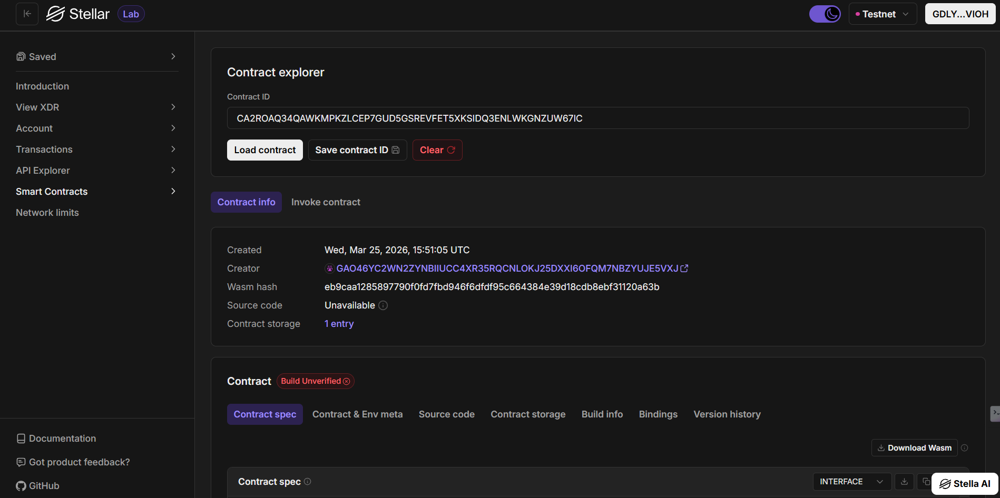

# Stellar Smart Contract Rush: High-Stakes Competitive Coding ⚡

  

A fully functional, decentralized competitive coding platform built on the **Stellar Soroban** blockchain. Developers compete in "Rushes" to solve smart contract challenges, optimize gas, and fix vulnerabilities, with real-time on-chain tracking and rewards.

## 🏆 Project Mission

The **Stellar Smart Contract Rush** aims to gamify the developer experience on the Soroban network. By creating an immersive "hacking" environment, developers are incentivized to write cleaner, more efficient, and more secure code. Every "Rush" is a battle of logic, optimized gas consumption, and speed.

---

## 🚀 Deployment Details

*   **Contract ID / Address:** `CA2ROAQ34QAWKMPKZLCEP7GUD5GSREVFET5XKSIDQ3ENLWKGNZUW67IC`
*   **Network:** Stellar Testnet
*   **WASM Hash:** `eb9caa1285897790f0fd7fbd946f6dfdf95c664384e39d18cdb8ebf31120a63b`

### Dashboard Preview



### On-Chain Verification



---

## ✨ Features

*   **⚡ Immersive Mission Console**: A dedicated "hacking" environment with live system logs, code viewers, and countdown timers.
*   **🛡️ On-Chain Competitive Logic**: Participate in challenges where submissions are tracked on-chain for speed and accuracy.
*   **📊 Dynamic Performance Dashboard**: Track your global rank, total XLM rewards, and active mission status with interactive charts.
*   **💎 Premium "Rush" Aesthetics**: A high-energy neon UI built with React, Vite, and Framer Motion, offering a professional fintech feel.
*   **🔐 Stellar Wallet Integration**: Securely join rushes, stake XLM, and broadcast solutions via the Stellar network.

---

## 🏗️ Project Architecture

The project is divided into two main components:

1.  **🚀 Smart Contract (`/contracts/escrow`)**: Written in Rust using the Soroban SDK (v25). It handles player staking, submission timestamps, and secure reward distribution using a robust escrow-based logic.
2.  **🎨 Frontend (`/frontend`)**: A high-performance React + Vite application that interacts with the deployed contract on the Stellar Testnet.

---

## 🛠️ Technology Stack

| Layer | Technology |
| :--- | :--- |
| **Blockchain** | Stellar Soroban |
| **Smart Contract** | Rust (Soroban SDK v25) |
| **Frontend** | React + Vite |
| **Styling** | Vanilla CSS + Framer Motion |
| **Wallet** | Freighter Extension |

---

## 📜 Smart Contract Interface

The core logic is handled by the `escrow` contract, which supports the following operations:

*   **`init`**: Sets up a new "Rush" mission with a designated arbiter, deadline, and reward pool.
*   **`fund`**: Players stake their XLM to join the mission and become eligible for rewards.
*   **`release`**: Rewards are distributed to the winner upon mission completion.
*   **`refund`**: Stakes are returned if the mission deadline is exceeded without a solution.
*   **`status`**: Provides real-time mission state (Funded vs. Closed).

---

## 🚀 Getting Started

### Prerequisites

*   [Node.js](https://nodejs.org/) (v18+)
*   [Rust](https://www.rust-lang.org/) (v1.80+)
*   [Stellar CLI](https://developers.stellar.org/docs/build/smart-contracts/getting-started/setup)
*   [Freighter Wallet Extension](https://www.freighter.app/)

### 1. Smart Contract (Phase A)

1.  **Build**:
    ```bash
    stellar contract build
    ```
2.  **Run Unit Tests**:
    ```bash
    cargo test -p escrow
    ```
3.  **Deploy**:
    ```bash
    stellar contract deploy --wasm target/wasm32v1-none/release/escrow.wasm --source-account <your-account> --network testnet --alias smart_contract_rush
    ```

### 2. Frontend Application (Phase B)

1.  Navigate to the frontend directory:
    ```bash
    cd frontend
    ```
2.  Install dependencies:
    ```bash
    npm install
    ```
3.  Start the development server:
    ```bash
    npm run dev
    ```
4.  Open `http://localhost:5173`.

---
Built with 🧡 on **Stellar Soroban**.
